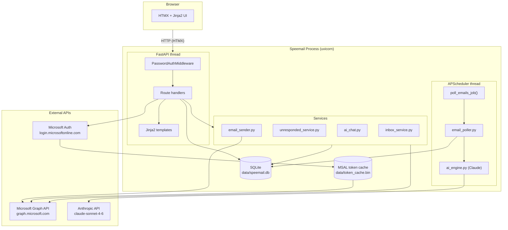
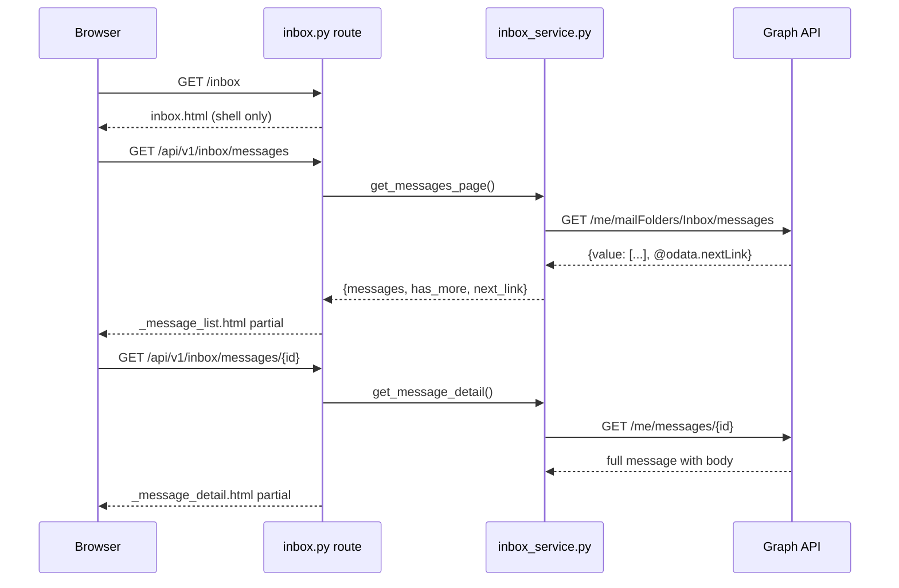
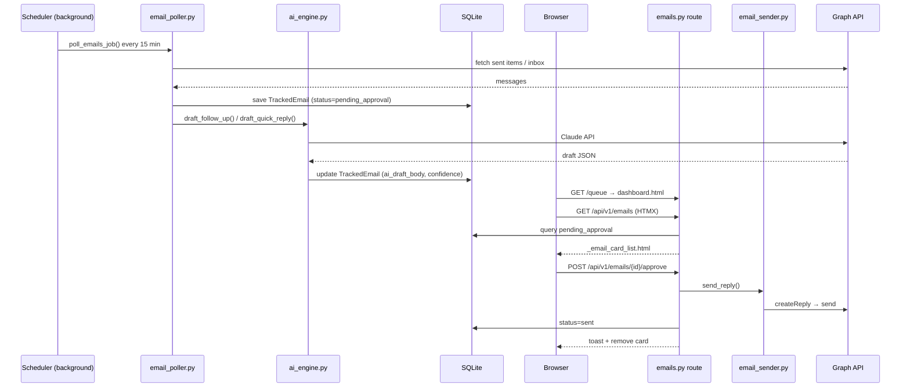
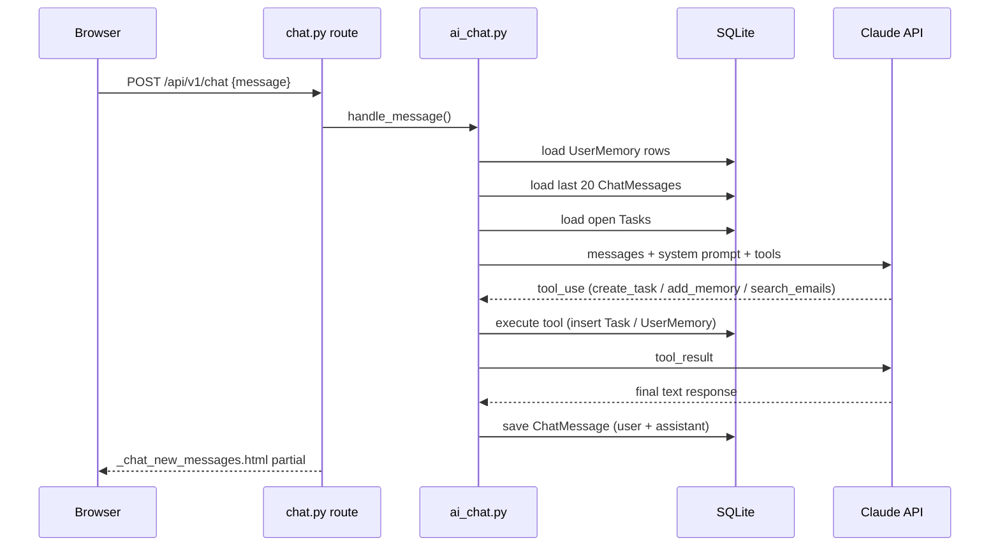
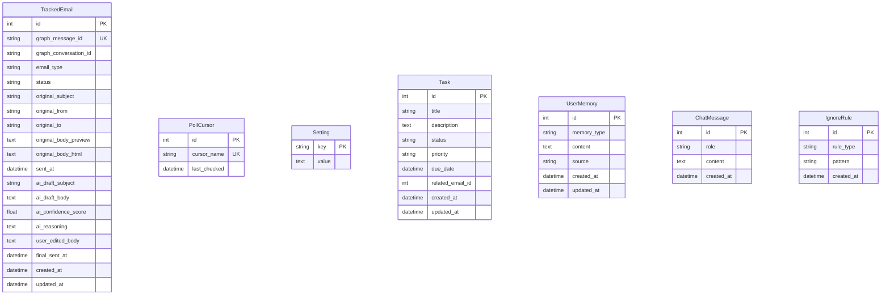

# Speemail Architecture

## System Overview



## Request Flow — Inbox



## Request Flow — AI Draft Approval



## AI Chat Panel Flow



## Database Schema



## File Map

```
speemail/
├── __main__.py               Entry point — starts uvicorn
├── main.py                   IPv4 socket patch (Fly.io compat), imports app
├── config.py                 All settings via pydantic-settings + .env
├── scheduler.py              APScheduler wiring — poll_emails_job()
│
├── auth/
│   └── graph_auth.py         MSAL OAuth flow + GraphClient (httpx wrapper)
│
├── middleware/
│   └── auth_middleware.py    Password gate (production SERVER_MODE)
│
├── models/
│   ├── database.py           SQLAlchemy engine + session factory
│   └── tables.py             ORM models: TrackedEmail, Task, UserMemory, etc.
│
├── services/
│   ├── email_poller.py       Fetch sent/inbox emails; deduplicate via DB cursor
│   ├── ai_engine.py          Claude prompts for follow-up / quick-reply drafts
│   ├── email_sender.py       Graph createReply + send
│   ├── inbox_service.py      Inbox browsing helpers (list page, message detail)
│   ├── unresponded_service.py  "Needs Your Reply" detection with 5-min cache
│   └── ai_chat.py            Chat panel — context assembly, tool use, memory
│
├── api/
│   ├── app.py                FastAPI app factory, lifespan, Jinja2 filters
│   ├── deps.py               Dependency injectors (DB session, GraphClient)
│   └── routes/
│       ├── auth.py           OAuth /auth/login + /auth/callback
│       ├── login.py          Password login page
│       ├── dashboard.py      Home page, needs-reply HTMX, debug endpoints
│       ├── inbox.py          Inbox list/detail, reply/forward/compose/trash
│       ├── emails.py         AI queue approve/edit/reject
│       ├── tasks.py          Task CRUD
│       ├── chat.py           Chat panel send/history/clear
│       ├── settings.py       Settings + ignore rules
│       └── scheduler_routes.py  Manual poll trigger, status
│
├── templates/
│   ├── base.html             Layout shell — nav, chat panel, keyboard shortcut modal
│   ├── home.html             Dashboard (needs-reply, awaiting, tasks, queue count)
│   ├── inbox.html            Two-pane inbox
│   ├── dashboard.html        AI queue
│   ├── history.html          Sent/rejected log
│   ├── tasks.html            Task list
│   ├── settings.html         Settings page
│   ├── login.html            Password login
│   ├── device_flow.html      OAuth device flow page
│   ├── auth_error.html       Auth error page
│   └── partials/
│       ├── _message_list.html      Inbox message rows
│       ├── _message_detail.html    Open message + reply/forward buttons
│       ├── _email_card.html        Single AI queue card
│       ├── _email_card_list.html   AI queue list
│       ├── _unresponded_list.html  Needs-reply / awaiting-response rows
│       ├── _task_card.html         Single task card
│       ├── _task_list.html         Task list
│       ├── _chat_messages.html     Full chat history
│       ├── _chat_new_messages.html New messages appended after send
│       ├── _compose_modal.html     New email modal
│       ├── _reply_modal.html       Reply modal
│       ├── _forward_modal.html     Forward modal
│       ├── _edit_modal.html        Edit AI draft modal
│       ├── _history_list.html      History rows
│       ├── _ignore_rules.html      Ignore rule list + add form
│       └── _toast.html             Toast notification
│
└── static/
    ├── keyboard.js           All keyboard shortcuts (no framework)
    └── style.css             All styles (single file)
```
